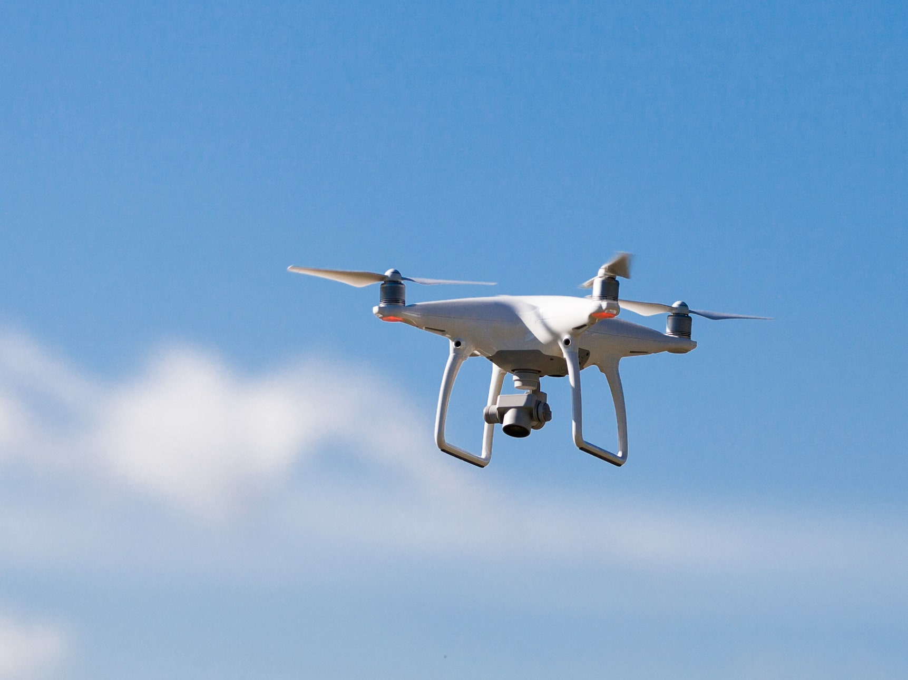
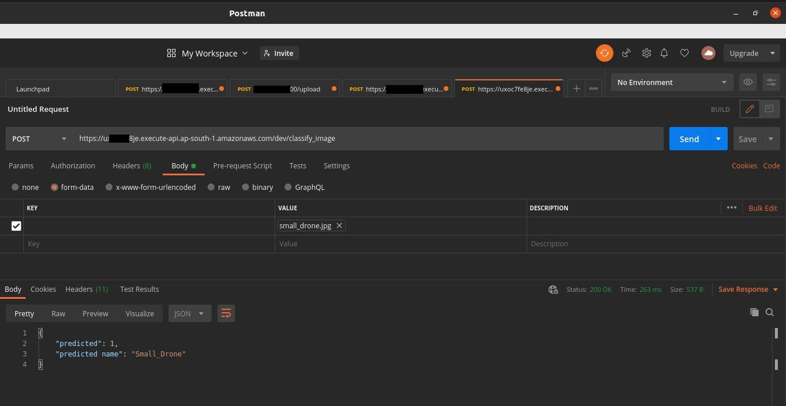

# AWS Lambda Basic Deployment

In this example, we trained model on bird & drones on mobilenet then deploy on **AWS Lambda using Serverless**

## Step1: Install Serverless(sls) & Create Serverless Service 

```
# Install Serverless
npm install -g serverless

# AWS Credential Setup with serverless config credentials command
serverless config credentials --provider aws --key AKIAIOSFODNN7_EXAMPLE --secret wJalrXUtnFEMI/K7MDENG/bPxRfiCY_EXAMPLE

# Create Serverless service locally , Will create sammple handler.py & serverless.yml file
serverless create \
  --template aws-python3 \
  --name bird \
  --path bird

cd bird
```

## Step 2: Run handler.py locally

```
# create conda virtual env
conda create --name torch_cpu python=3.8

# install Torch & torchvision for cpu
pip install -r requirements.txt

# Run handller.py locally & cross-check expected output
python handler.py

```

## Step 3: Deploy Serverless Service

Edit the serverless.yml & add serverless-python-requirements plugin

```
sls plugin install -n serverless-python-requirements

# Deploy
sls deploy
```

## Send Image to AWS Lambda via POST API & Receive Prediction

Once AWS lambda function deployed, we can predict output by sending POST request

**Input Image:**



**Prediction:**




## Reference
[How to Handle your Python packaging in Lambda with Serverless plugins](https://www.serverless.com/blog/serverless-python-packaging)

[ML deploy to aws lambda with serverless](https://penzai.dev/posts/ml-deploy-to-aws-lambda-with-serverless/)
